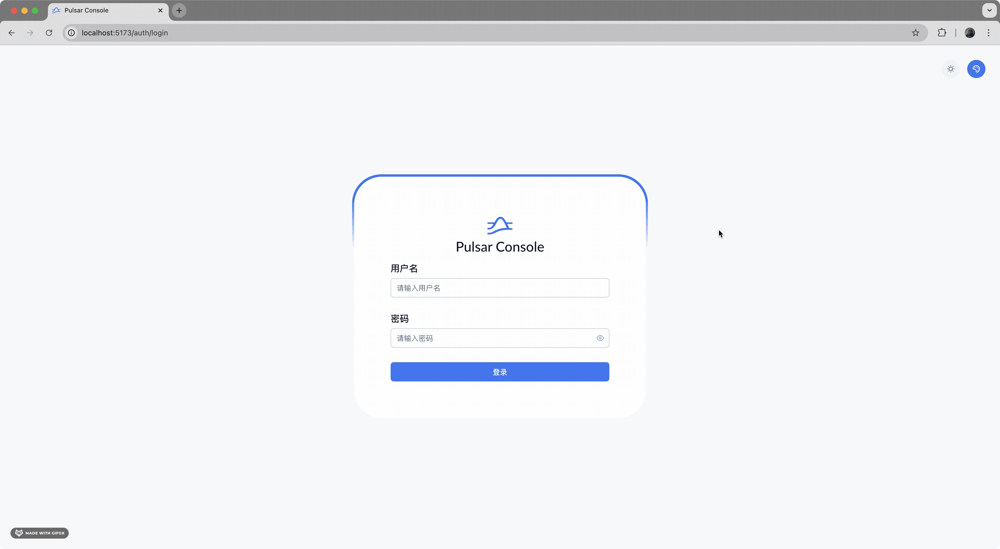
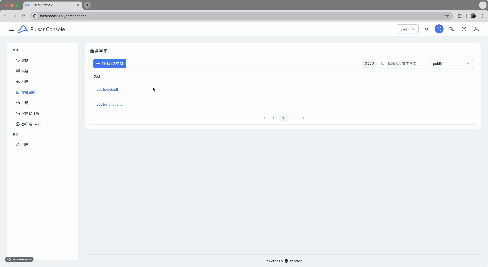
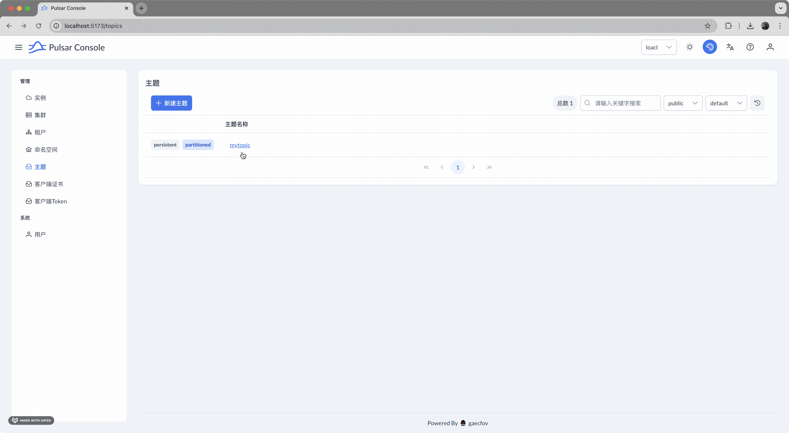

[English](README_en.md)

# 介绍
Pulsar Console 是基于 Pulsar Admin REST Api 构建的Pulsar UI控制台

## 主要功能
* 支持多实例管理
* 支持多用户
* 支持多语言

# 代码说明
Pulsar Console 使用前后端开发分离模式开发。

## 前端(front-end)
* 基于 Vue3、Pinia
* UI 基于PrimeVue4 开发
* 使用pnpm 包管理器

## 后端
* 基于 SpringBoot3.3.2开发
* 使用 JPA、默认使用H2 数据库，也可以换成其他jpa 支持的数据库
* 支持 JDK17 及以上版本

# 本地开发
本地开发时，前端会进行后端请求的转发代理，默认转发到 http://localhost:8080，可以在 vite.config.mjs 中配置
## 启动前端
```
cd front-end
# 首次运行需要先install
pnpm install
pnpm dev
```
## 启动后端
直接启动 PulsarConsoleApplication

# 部署
## jar 包部署
jar 包部署主要是 3 步：

2. 编译后端
3. 执行 jar 包

```shell
# 1. 编译前端，文件会输出到 springboot 项目的 resources/static 目录下
pnpm -F ./front-end build
# 2. 编译后端
mvn clean package -DskipTests
# 3. 执行jar 包
java -jar target/pulsar-console-[version].jar
```

## Docker
```
docker run -d \
--name pulsar-console \
-p 8080:8080 \
gaecfovdocker/pulsar-console:latest
```

### 自定义数据库
```shell
docker run -d \
  --name pulsar-console \
  -e PC_JDBC_URL= \
  -e PC_JDBC_DRIVER_CLASS_NAME= \
  -e PC_JDBC_USERNAME= \
  -e PC_JDBC_PASSWORD= \
  -p 8080:8080 \
  gaecfovdocker/pulsar-console:latest
```

# 登录账号
应用启动会检测一次是否存在 admin 账号，如果没有会自动创建，密码在日志中会打印
```
grep superuser logs/app.log
```








