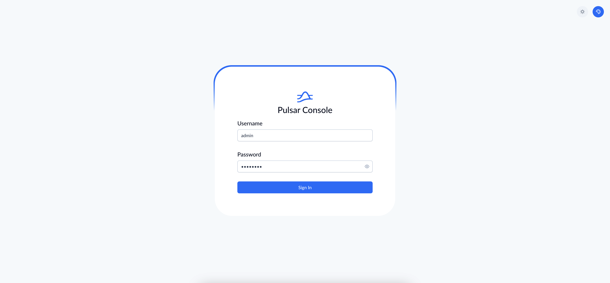
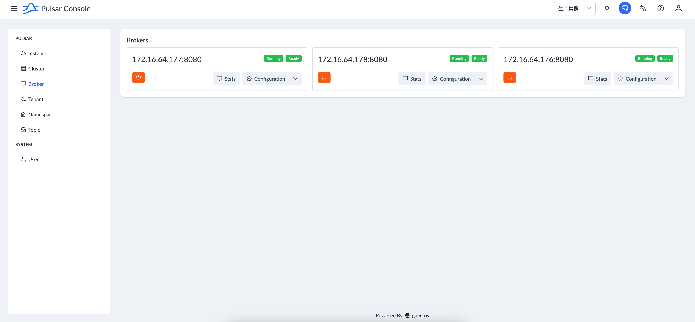
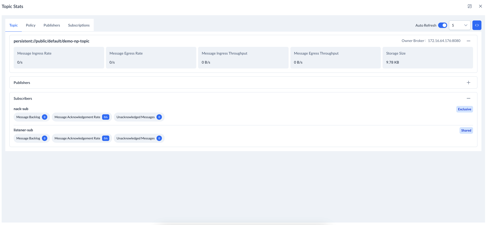
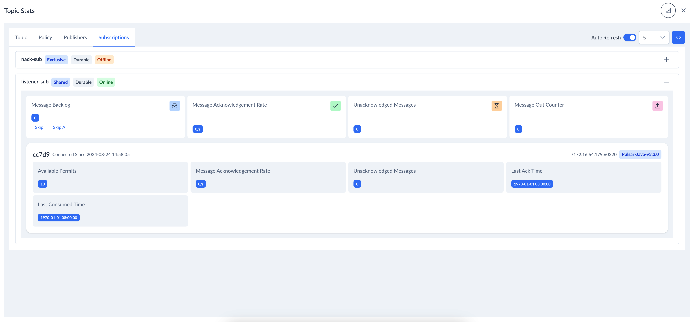

[中文](README.md)

# Introduction

Pulsar Console is a web-based GUI management tool for managing and monitoring Pulsar.

## Key Features

* Supports multi-instance management
* Supports multiple users
* Supports multiple languages

## Code Overview

Pulsar Console is developed with a separation of front-end and back-end development.

### Front-End

* Based on Vue 3 and Pinia
* UI developed with PrimeVue 4
* Uses pnpm package manager

### Back-End

* Developed with Spring Boot 3.3.2
* Uses JPA, with H2 database as the default, but other JPA-supported databases can be used
* Supports JDK 17 and above

## Local Development

During local development, the front-end will proxy requests to the back-end, which by default is forwarded to http://localhost:8080. This can be configured in vite.config.mjs.

### Start Front-End
```shell
cd front-end
# Install dependencies if running for the first time
pnpm install
pnpm dev
```
### Start Back-End

Simply start PulsarConsoleApplication

## Deployment

JAR Package Deployment

Deployment of the JAR package involves 3 main steps:

1. Build the front-end, which will output files to the resources/static directory of the Spring Boot project.
2. Build the back-end.
3. Run the JAR package.
```
# 1. Build the front-end
pnpm -F ./front-end build
# 2. Build the back-end
mvn clean package -DskipTests
# 3. Run the JAR package
java -jar target/pulsar-console-[version].jar
```
## Login Account

The app will check once to see if an admin account exists. If not, the admin account will be created automatically and the password will be printed in the log
```
grep superuser logs/app.log
```




